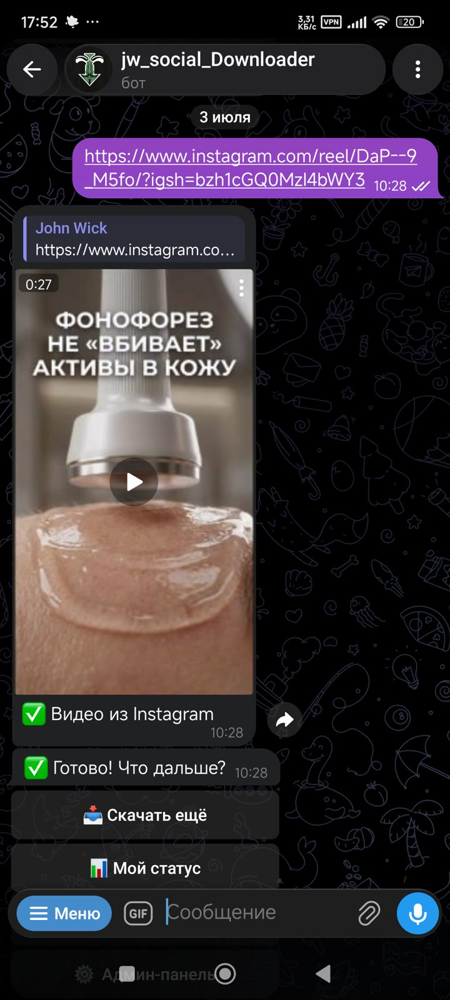
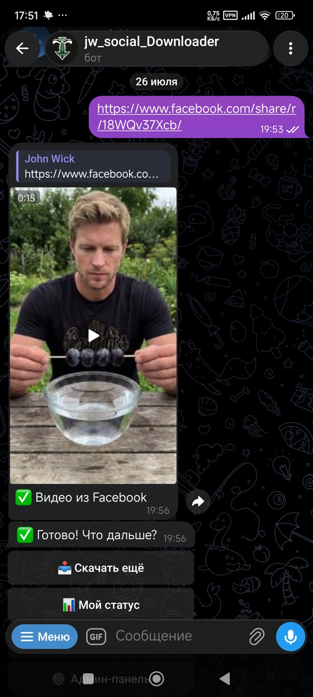

# jw_social_downloader

**Telegram-бот для скачивания видео и фото из Instagram, TikTok, Facebook, Pinterest и YouTube.**


[Русский](#русский) · [English](#english)

---

## 📱 Демонстрация / Demo

<p align="center">
  
  &nbsp;&nbsp;
  
</p>

<p align="center"><sub>Слева — скачивание Reels из Instagram · справа — видео из Facebook: бот принимает ссылку и возвращает готовое медиа.<br/>Left — an Instagram Reel · right — a Facebook video: the bot takes a link and returns ready-to-use media.</sub></p>

---

## Русский

### Содержание
- [О проекте](#о-проекте)
- [Возможности для пользователя](#возможности-для-пользователя)
- [Технические особенности](#технические-особенности)
- [Админ-панель](#админ-панель)
- [Стек технологий](#стек-технологий)
- [Структура проекта](#структура-проекта)
- [Установка и запуск](#установка-и-запуск)
- [Конфигурация](#конфигурация)
- [Портфолио](#портфолио)

### О проекте

**jw_social_downloader** — асинхронный Telegram-бот на **aiogram 3.x**, который скачивает видео и фото из популярных соцсетей по присланной пользователем ссылке и отправляет медиа обратно в чат. Бот построен с прицелом на надёжность: устойчив к капризам конкретных платформ (смена форматов, WAF-челленджи, geo/age-ограничения), аккуратно работает с лимитами Telegram на размер и тип вложений и не деградирует под нагрузкой благодаря ограничению параллелизма и анти-флуд мидлварам.

**Поддерживаемые платформы:**

| Платформа | Что скачивается | Особенность обработки |
|---|---|---|
| Instagram | Видео, Reels, карусели, фото | `bv*+ba` для более высокого разрешения из DASH; fallback на gallery-dl для смешанных каруселей `/p/` |
| TikTok | Видео, слайдшоу-фото | Приоритет H.264, ретрай транзиторного WAF-челленджа, учёт watermark-версий; слайдшоу `/photo/` — через gallery-dl |
| Facebook | Видео | Приоритет H.264/avc1 над AV1 (иначе «звук без картинки»), size-aware выбор DASH-потоков под лимит размера |
| Pinterest | Картинки, доски | Полностью через gallery-dl (yt-dlp не умеет корректно тянуть картинки/доски) |
| YouTube | Видео | Клиенты web_safari/android_vr/tv, avc1/mp4, `manifest-filesize-approx`, плавная деградация качества |

### Возможности для пользователя

- Управление через inline-кнопки, дружелюбное приветственное меню.
- **3 бесплатных скачивания** для новых пользователей, далее — платная подписка (30 дней, безлимит).
- Мультивалютная оплата: **USDT (TRC20)**, **VND**, **THB**.
- Раздел «Профиль»: сколько бесплатных скачиваний осталось, до какой даты активна подписка, сколько всего скачано.
- Раздел поддержки — прямая связь с админом, а также раздел с помощью/FAQ по боту.

### Технические особенности

Раздел для тех, кто хочет заглянуть «под капот» — это основная инженерная часть проекта:

- **Полностью асинхронная архитектура** на aiogram 3.x: ограничение параллелизма загрузок через семафор (по умолчанию 3 одновременных загрузки) плюс throttle-мидлварь против флуда от одного пользователя.
- **Платформо-специфичный подбор форматов** — ключевая борьба с типичной проблемой «видео пришло, но звук без картинки» в Telegram-плеере:
  - *Facebook*: приоритет кодека H.264/avc1 над AV1 (Telegram-плеер на многих клиентах не проигрывает AV1 корректно), size-aware выбор DASH-потока с учётом лимита размера файла.
  - *YouTube*: перебор клиентов `web_safari` → `android_vr` → `tv` для получения H.264/mp4-потоков, использование `manifest-filesize-approx` для оценки размера без полной загрузки манифеста, плавная деградация качества при превышении лимита.
  - *TikTok*: приоритет H.264, ретрай при транзиторном WAF-челлендже (rehydration/403 — платформа флапает, а не банит по IP), учёт видео с водяным знаком и без.
  - *Instagram*: селектор `bv*+ba` для получения максимального доступного разрешения из DASH-потоков.
- **gallery-dl как fallback** там, где yt-dlp принципиально не справляется: доски и картинки Pinterest, смешанные карусели Instagram (`/p/`), слайдшоу-фото TikTok (`/photo/`).
- **Аккуратная отправка медиа**: альбомы отправляются чанками по 5 (лимит Telegram на медиа-группу), крупные изображения (>10 МБ) уходят документом, смешанные медиа-группы (видео+фото) обрабатываются без потери порядка.
- **Сетевая устойчивость**: повторная отправка с экспоненциальным backoff, корректная обработка `TelegramRetryAfter` (учёт `retry_after` от Telegram API).
- **Продуманная работа с базой данных**: короткие write-транзакции в SQLAlchemy 2.x (async), чтобы не держать SQLite write-lock во время долгой (до 120 секунд) загрузки и аплоада медиа.
- **Понятные пользователю сообщения об ошибках**: устаревшие cookies, приватное видео, гео-блокировка, возрастное ограничение, файл слишком большой, рейт-лимит платформы и т.д. — без сырых traceback.
- **Лимиты и очистка**: лимит размера файла (по умолчанию 50 МБ), таймаут загрузки (120 секунд), немедленная автоочистка временных файлов после отправки плюс периодическая фоновая очистка «зависших» файлов.

### Админ-панель

Доступна только администратору (`ADMIN_ID` из конфигурации) по команде `/admin`:

- Поиск пользователя по ID или @username.
- Выдача подписки вручную (+N дней).
- Бан / разбан пользователя.
- Статистика: всего пользователей, активных подписок, количество скачиваний за 24 часа / 7 дней / 30 дней.

### Стек технологий

| Категория | Технология |
|---|---|
| Язык | Python 3.12 |
| Telegram-фреймворк | aiogram 3.x (async) |
| Загрузка медиа | yt-dlp (основной инструмент) |
| Fallback-загрузка | gallery-dl (картинки/слайдшоу/доски) |
| Обработка видео | ffmpeg |
| ORM / БД | SQLAlchemy 2.x (async) + aiosqlite (SQLite) |
| Конфигурация | pydantic-settings (`.env`) |
| Логирование | loguru (ротация 10 МБ, хранение 7 дней) |
| JS-рантайм | Deno (для YouTube web_safari, H.264) |
| HTTP-impersonation | curl-cffi (TikTok, Instagram) |
| Деплой | Docker + docker-compose, host-network, tmpfs 200 МБ |

> Режим `host-network` в docker-compose используется намеренно: Docker NAT (bridge-сеть) роняет крупные аплоады в Telegram из-за проблем с path MTU, host-network это обходит.

### Структура проекта

```
bot/
├── __main__.py        # точка входа: bot/dispatcher, middleware, роутеры, cleanup-task
├── config.py           # конфиг pydantic-settings (.env)
├── db/                 # engine.py, models.py (User, DownloadLog), queries.py
├── handlers/           # user.py (флоу пользователя), admin.py (админ-панель)
├── keyboards/          # inline.py — inline-клавиатуры
├── middlewares/        # throttle.py — анти-флуд
├── services/           # downloader.py (yt-dlp/gallery-dl), cleanup.py
└── utils/              # url_parser.py — ссылка → платформа
Dockerfile
docker-compose.yml
requirements.txt
.env.example
```

### Установка и запуск

#### Docker (рекомендуется)

```bash
git clone https://github.com/jw-git-hub/jw_social_downloader.git
cd jw_social_downloader
cp .env.example .env      # заполнить BOT_TOKEN, ADMIN_ID и т.д.
docker compose up -d --build
```

#### Локально

Требуются системные `ffmpeg` и `deno`.

```bash
python -m venv .venv && source .venv/bin/activate
pip install -r requirements.txt
cp .env.example .env
python -m bot
```

### Конфигурация

Все настройки берутся из `.env` (шаблон — `.env.example`). Реальные значения хранятся только в локальном `.env`, который **не коммитится в репозиторий**.

Ключевые переменные:

| Переменная | Назначение |
|---|---|
| `BOT_TOKEN` | Токен Telegram-бота от @BotFather |
| `ADMIN_ID` | Telegram ID администратора |
| `ADMIN_USERNAME` | Username администратора для раздела поддержки |
| `DATABASE_URL` | Строка подключения к БД (SQLite/aiosqlite) |
| Платёжные реквизиты | Адреса/реквизиты для приёма USDT (TRC20), VND, THB |
| `COOKIES_FILE` | Путь к файлу cookies для приватного/возрастного контента |
| `TIKTOK_PROXY` | Прокси для обхода транзиторного TikTok WAF (опционально) |

Пример значений — плейсхолдеры вида `YOUR_BOT_TOKEN`, `123456789`, `@your_admin_username`.

### Портфолио

Этот репозиторий — часть портфолио. Автор разрабатывает Telegram-ботов и сайты под заказ: от простых ботов-помощников до сложных систем с платными подписками, админ-панелями и интеграциями с внешними сервисами.

Открыт к сотрудничеству — пишите через профиль GitHub: [**@jw-git-hub**](https://github.com/jw-git-hub).

**Лицензия.** Код опубликован в демонстрационных целях как часть портфолио. Формальной open-source лицензии нет; коммерческое использование — по договорённости с автором.

---

## English

### Contents
- [About](#about)
- [User Features](#user-features)
- [Technical Highlights](#technical-highlights)
- [Admin Panel](#admin-panel)
- [Tech Stack](#tech-stack)
- [Project Structure](#project-structure)
- [Installation & Running](#installation--running)
- [Configuration](#configuration)
- [Portfolio](#portfolio)

### About

**jw_social_downloader** is an asynchronous Telegram bot built on **aiogram 3.x** that downloads videos and photos from popular social platforms given a link, and sends the media back to the chat. The bot is engineered for reliability: it withstands each platform's quirks (shifting formats, WAF challenges, geo/age restrictions), carefully respects Telegram's size and attachment-type limits, and stays stable under load thanks to concurrency limiting and anti-flood middleware.

**Supported platforms:**

| Platform | What it downloads | Processing notes |
|---|---|---|
| Instagram | Videos, Reels, carousels, photos | `bv*+ba` selector for the highest available DASH resolution; gallery-dl fallback for mixed `/p/` carousels |
| TikTok | Videos, photo slideshows | H.264 priority, retry on transient WAF challenges, handles both watermarked and clean versions; `/photo/` slideshows go through gallery-dl |
| Facebook | Videos | H.264/avc1 prioritized over AV1 (otherwise "video with no picture"), size-aware DASH stream selection against the size limit |
| Pinterest | Images, boards | Handled entirely via gallery-dl (yt-dlp cannot correctly pull images/boards) |
| YouTube | Videos | web_safari/android_vr/tv clients, avc1/mp4, `manifest-filesize-approx`, graceful quality degradation |

### User Features

- Inline-button navigation with a friendly welcome menu.
- **3 free downloads** for new users, then a paid subscription (30 days, unlimited).
- Multi-currency payments: **USDT (TRC20)**, **VND**, **THB**.
- A "Profile" section: remaining free downloads, subscription expiry date, total downloads to date.
- A support section for direct contact with the admin, plus a help/FAQ section.

### Technical Highlights

This is the core engineering showcase of the project:

- **Fully asynchronous architecture** on aiogram 3.x: download concurrency is capped with a semaphore (3 concurrent downloads by default), plus a throttle middleware guarding against flooding from a single user.
- **Platform-specific format selection** — the key fix for the classic Telegram-player problem of "video plays with no picture, audio only":
  - *Facebook*: H.264/avc1 is prioritized over AV1 (many Telegram clients fail to render AV1 correctly), with size-aware DASH stream selection against the file-size limit.
  - *YouTube*: falls through `web_safari` → `android_vr` → `tv` clients to obtain H.264/mp4 streams, uses `manifest-filesize-approx` to estimate size without downloading the full manifest, and degrades quality gracefully when the size limit would otherwise be exceeded.
  - *TikTok*: H.264 priority, automatic retry on transient WAF challenges (rehydration/403 — the platform is rate-sensitive and flaky rather than IP-blocking), correct handling of both watermarked and watermark-free video versions.
  - *Instagram*: a `bv*+ba` selector to pull the highest resolution available from DASH streams.
- **gallery-dl as a fallback** wherever yt-dlp fundamentally cannot cope: Pinterest boards and images, mixed Instagram `/p/` carousels, TikTok `/photo/` slideshows.
- **Careful media delivery**: albums are sent in chunks of 5 (Telegram's media-group limit), large images (>10 MB) are sent as documents, and mixed media groups (video + photo) are handled without losing order.
- **Network resilience**: retried sends with exponential backoff, and correct handling of `TelegramRetryAfter` (honoring the Telegram API's `retry_after` value).
- **Careful database design**: short write transactions in SQLAlchemy 2.x (async) so the SQLite write lock is never held during a long (up to 120s) download/upload operation.
- **User-friendly error messages**: stale cookies, private videos, geo-blocks, age restrictions, oversized files, platform rate limits, and more — no raw tracebacks shown to the user.
- **Limits and cleanup**: configurable file-size limit (50 MB by default), download timeout (120s), immediate temp-file cleanup after sending plus a periodic background sweep for any leftover files.

### Admin Panel

Available only to the administrator (`ADMIN_ID` from configuration) via the `/admin` command:

- Look up a user by ID or @username.
- Grant a subscription manually (+N days).
- Ban / unban a user.
- Statistics: total users, active subscriptions, downloads over the last 24h / 7d / 30d.

### Tech Stack

| Category | Technology |
|---|---|
| Language | Python 3.12 |
| Telegram framework | aiogram 3.x (async) |
| Media downloading | yt-dlp (primary tool) |
| Fallback downloading | gallery-dl (images/slideshows/boards) |
| Video processing | ffmpeg |
| ORM / database | SQLAlchemy 2.x (async) + aiosqlite (SQLite) |
| Configuration | pydantic-settings (`.env`) |
| Logging | loguru (10 MB rotation, 7-day retention) |
| JS runtime | Deno (for YouTube web_safari, H.264) |
| HTTP impersonation | curl-cffi (TikTok, Instagram) |
| Deployment | Docker + docker-compose, host network, 200 MB tmpfs |

> The `host-network` mode in docker-compose is intentional: Docker's default bridge network (NAT) breaks large Telegram uploads due to path-MTU issues, and host networking avoids that entirely.

### Project Structure

```
bot/
├── __main__.py        # entry point: bot/dispatcher, middleware, routers, cleanup task
├── config.py           # pydantic-settings config (.env)
├── db/                 # engine.py, models.py (User, DownloadLog), queries.py
├── handlers/           # user.py (user flow), admin.py (admin panel)
├── keyboards/          # inline.py — inline keyboards
├── middlewares/         # throttle.py — anti-flood
├── services/           # downloader.py (yt-dlp/gallery-dl), cleanup.py
└── utils/               # url_parser.py — link → platform
Dockerfile
docker-compose.yml
requirements.txt
.env.example
```

### Installation & Running

#### Docker (recommended)

```bash
git clone https://github.com/jw-git-hub/jw_social_downloader.git
cd jw_social_downloader
cp .env.example .env      # fill in BOT_TOKEN, ADMIN_ID, etc.
docker compose up -d --build
```

#### Local

Requires system-level `ffmpeg` and `deno`.

```bash
python -m venv .venv && source .venv/bin/activate
pip install -r requirements.txt
cp .env.example .env
python -m bot
```

### Configuration

All settings are sourced from `.env` (template: `.env.example`). Real values live only in a local `.env` file, which **is not committed to the repository**.

Key variables:

| Variable | Purpose |
|---|---|
| `BOT_TOKEN` | Telegram bot token from @BotFather |
| `ADMIN_ID` | Administrator's Telegram ID |
| `ADMIN_USERNAME` | Administrator's username for the support section |
| `DATABASE_URL` | Database connection string (SQLite/aiosqlite) |
| Payment details | Addresses/details for accepting USDT (TRC20), VND, THB |
| `COOKIES_FILE` | Path to a cookies file for private/age-restricted content |
| `TIKTOK_PROXY` | Proxy to work around transient TikTok WAF challenges (optional) |

Example values are placeholders such as `YOUR_BOT_TOKEN`, `123456789`, `@your_admin_username`.

### Portfolio

This repository is part of a portfolio. The author builds custom Telegram bots and websites — from simple helper bots to more complex systems with paid subscriptions, admin panels, and third-party integrations.

Open to collaboration — reach out via the GitHub profile: [**@jw-git-hub**](https://github.com/jw-git-hub).

**License.** The code is published for demonstration purposes as part of a portfolio. There is no formal open-source license; commercial use is available by arrangement with the author.
