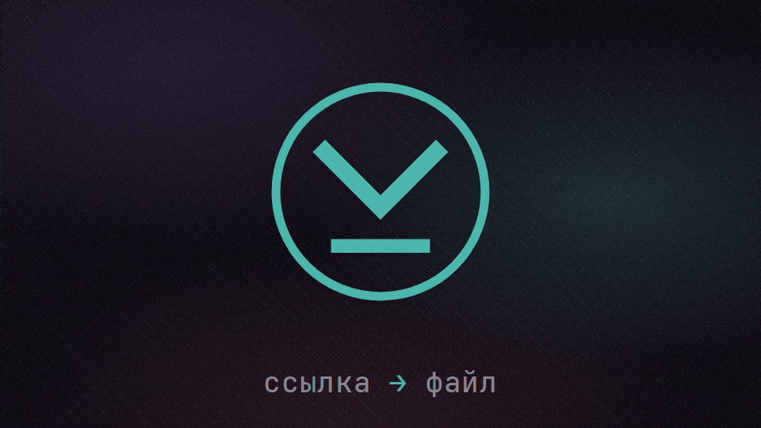
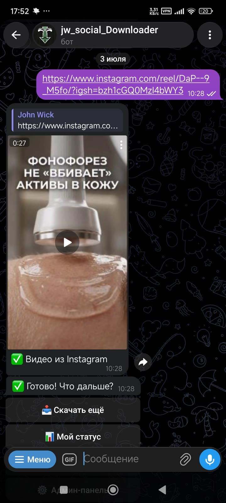
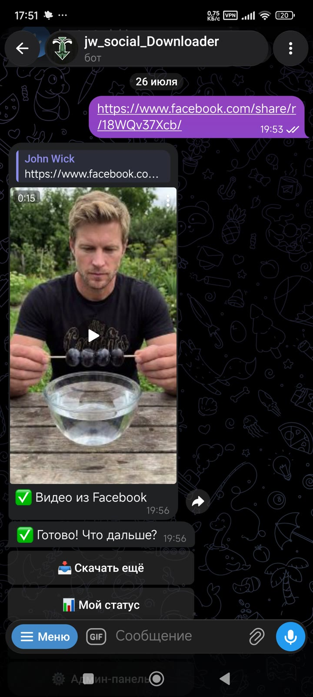

<p align="center">
  
</p>

# jw_social_downloader

**Telegram-бот для скачивания видео и фото из Instagram, TikTok, Facebook, Pinterest и YouTube.**


[Русский](#русский) · [English](#english)

---

## 📱 Демонстрация / Demo

<p align="center">
  
  &nbsp;&nbsp;
  
</p>

<p align="center"><sub>Слева — скачивание Reels из Instagram · справа — видео из Facebook: бот принимает ссылку и возвращает готовое медиа.<br/>Left — an Instagram Reel · right — a Facebook video: the bot takes a link and returns ready-to-use media.</sub></p>

---

## Русский

### Содержание
- [О проекте](#о-проекте)
- [Возможности для пользователя](#возможности-для-пользователя)
- [Технические особенности](#технические-особенности)
- [Админ-панель](#админ-панель)
- [Стек технологий](#стек-технологий)
- [Структура проекта](#структура-проекта)
- [Установка и запуск](#установка-и-запуск)
- [Конфигурация](#конфигурация)
- [Локальный Bot API](#локальный-bot-api)
- [Портфолио](#портфолио)

### О проекте

**jw_social_downloader** — асинхронный Telegram-бот на **aiogram 3.x**, который скачивает видео и фото из популярных соцсетей по присланной пользователем ссылке и отправляет медиа обратно в чат. Бот построен с прицелом на надёжность: устойчив к капризам конкретных платформ (смена форматов, WAF-челленджи, geo/age-ограничения), аккуратно работает с лимитами Telegram на размер и тип вложений и не деградирует под нагрузкой благодаря ограничению параллелизма и анти-флуд мидлварам.

**Поддерживаемые платформы:**

| Платформа | Что скачивается | Особенность обработки |
|---|---|---|
| Instagram | Видео, Reels, карусели, фото | `bv*+ba` для более высокого разрешения из DASH; fallback на gallery-dl для смешанных каруселей `/p/` |
| TikTok | Видео, слайдшоу-фото | Приоритет H.264, ретрай транзиторного WAF-челленджа, учёт watermark-версий; слайдшоу `/photo/` — через gallery-dl |
| Facebook | Видео | Приоритет H.264/avc1 над AV1 (иначе «звук без картинки»), size-aware выбор DASH-потоков под лимит размера |
| Pinterest | Картинки, доски | Полностью через gallery-dl (yt-dlp не умеет корректно тянуть картинки/доски) |
| YouTube | Видео | Максимальное разрешение без потолка в любом кодеке (при равном разрешении H.264 → VP9 → AV1), SDR вместо HDR, ступенька вниз по разрешению под лимит размера |

### Возможности для пользователя

- Управление через inline-кнопки, дружелюбное приветственное меню.
- **До 5 ссылок за раз** — одним сообщением или по одной: бот качает их по очереди, у каждой свой статус с местом в очереди.
- **Живой статус загрузки** в одном сообщении: заранее видно, какое качество и размер придут (и почему не максимум, если пришлось понизить), при скачивании — шкала ▰▱ с процентами и оставшимся временем, при отправке в Telegram — примерный процент.
- **3 бесплатных скачивания в сутки** (скользящие 24 часа); неудачное скачивание не списывается. Когда бесплатные кончились, бот говорит, через сколько откроется следующее.
- **Подписка за звёзды Telegram** — 250 ⭐ за 30 дней безлимита, продлевается автоматически; отменить можно в настройках Telegram → «Мои звёзды». Оплата прямо в Telegram, без реквизитов и скриншотов.
- Команды `/terms` (условия), `/support` (поддержка), `/paysupport` (вопросы по оплате и возвратам).
- Раздел «Профиль»: сколько бесплатных осталось на сутки и через сколько откроется следующее, до какой даты активна подписка, сколько всего скачано.
- Раздел поддержки — прямая связь с админом, а также раздел с помощью/FAQ по боту.

### Технические особенности

Раздел для тех, кто хочет заглянуть «под капот» — это основная инженерная часть проекта:

- **Полностью асинхронная архитектура** на aiogram 3.x: ограничение параллелизма загрузок через семафор (по умолчанию 3 одновременных загрузки) плюс throttle-мидлварь против флуда от одного пользователя.
- **Платформо-специфичный подбор форматов** — ключевая борьба с типичной проблемой «видео пришло, но звук без картинки» в Telegram-плеере:
  - *Facebook*: приоритет кодека H.264/avc1 над AV1 (Telegram-плеер на многих клиентах не проигрывает AV1 корректно), size-aware выбор DASH-потока с учётом лимита размера файла.
  - *YouTube*: максимальное доступное разрешение без потолка в любом кодеке (8K у YouTube бывает только в AV1; владелец выбрал всегда лучшее доступное) — при равном разрешении предпочитается H.264, затем VP9 и AV1, звук AAC; если разрешение не влезает в лимит размера, берётся следующее по убыванию, а не отказ. Дорожки склеиваются в MP4 без перекодирования. Скачивание идёт параллельными фрагментами (иначе холодный сервер YouTube не укладывается в таймаут на крупном ролике), недоступный фрагмент — это честный отказ с возвратом квоты, а не битое видео; исходящий трафик к YouTube — по IPv4, в обход IPv6-бот-чека.
  - *TikTok*: приоритет H.264, ретрай при транзиторном WAF-челлендже (rehydration/403 — платформа флапает, а не банит по IP), учёт видео с водяным знаком и без.
  - *Instagram*: селектор `bv*+ba` для получения максимального доступного разрешения из DASH-потоков.
- **gallery-dl как fallback** там, где yt-dlp принципиально не справляется: доски и картинки Pinterest, смешанные карусели Instagram (`/p/`), слайдшоу-фото TikTok (`/photo/`).
- **Аккуратная отправка медиа**: альбомы отправляются чанками по 5 (лимит Telegram на медиа-группу), крупные изображения (>10 МБ) уходят документом, смешанные медиа-группы (видео+фото) обрабатываются без потери порядка.
- **Сетевая устойчивость**: повторная отправка с экспоненциальным backoff, корректная обработка `TelegramRetryAfter` (учёт `retry_after` от Telegram API).
- **Продуманная работа с базой данных**: короткие write-транзакции в SQLAlchemy 2.x (async), чтобы не держать SQLite write-lock во время долгой (до 15 минут) загрузки и аплоада медиа.
- **Понятные пользователю сообщения об ошибках**: устаревшие cookies, приватное видео, гео-блокировка, возрастное ограничение, файл слишком большой, рейт-лимит платформы и т.д. — без сырых traceback.
- **Лимиты и очистка**: лимит размера файла (до 50 МБ на облачном Bot API, до `MAX_FILE_SIZE_MB` на своём — см. «Локальный Bot API»), таймаут загрузки 15 минут, немедленная автоочистка временных файлов после отправки плюс периодическая фоновая очистка «зависших» файлов.
- **Статус загрузки в одном сообщении**: перед стартом бот сразу пишет ожидаемое качество и размер файла и поясняет, если оно ниже максимального (например, «в 4K видео весит больше лимита, пришлю в 1080p»); во время скачивания — шкала ▰▱ с процентами и оставшимся временем, на этапе склейки видео со звуком — «Собираю видео и звук…», при отправке в Telegram — приблизительный процент по средней скорости последних отправок (сам Telegram прогресс приёма файла не отдаёт). Правки сообщения троттлятся и не роняют саму загрузку при сетевом сбое или флуд-лимите Telegram.
- **Очередь до 5 ссылок на пользователя**: несколько ссылок можно прислать одним сообщением или по одной — качаются строго по очереди, у каждой свой статус с местом в очереди («В очереди: 2-я»). Бесплатное скачивание резервируется в момент постановки в очередь, а не когда до ссылки доходит очередь, поэтому квоту нельзя обойти, закинув сразу несколько ссылок. Если бот перезапустился, пока ссылка ждала или качалась, при следующем старте пользователю приходит список недокачанных ссылок, а бесплатные попытки за них возвращаются.
- **Надёжная оплата**: платёж не теряется ни антифлудом, ни перезапуском бота (очередь простоя разбирается — платежи зачисляются, старые ссылки выбрасываются); повторная доставка платежа не продлевает подписку дважды; бесплатный лимит бронируется атомарно одной командой базы.

### Админ-панель

Доступна только администратору (`ADMIN_ID` из конфигурации) по команде `/admin`:

- Поиск пользователя по ID или @username.
- Выдача подписки вручную (+N дней).
- Платежи пользователя звёздами и возврат в два нажатия — возврат сразу отменяет автопродление и снимает подписку.
- Бан / разбан пользователя.
- Статистика: всего пользователей, активных подписок, количество скачиваний за 24 часа / 7 дней / 30 дней.
- Уведомление админу о каждой оплате и продлении.

### Стек технологий

| Категория | Технология |
|---|---|
| Язык | Python 3.12 |
| Telegram-фреймворк | aiogram 3.x (async) |
| Загрузка медиа | yt-dlp (основной инструмент) |
| Fallback-загрузка | gallery-dl (картинки/слайдшоу/доски) |
| Обработка видео | ffmpeg |
| ORM / БД | SQLAlchemy 2.x (async) + aiosqlite (SQLite) |
| Конфигурация | pydantic-settings (`.env`) |
| Логирование | loguru (ротация 10 МБ, хранение 7 дней) |
| JS-рантайм | Deno (решение JS-челленджей YouTube для yt-dlp) |
| HTTP-impersonation | curl-cffi (TikTok, Instagram) |
| Деплой | Docker + docker-compose, host-network, tmpfs 200 МБ |

> Режим `host-network` в docker-compose используется намеренно: Docker NAT (bridge-сеть) роняет крупные аплоады в Telegram из-за проблем с path MTU, host-network это обходит.

### Структура проекта

```
bot/
├── __main__.py        # точка входа: bot/dispatcher, middleware, роутеры, cleanup-task,
│                        # разбор очереди простоя, уведомление о ссылках, не докачанных до рестарта
├── config.py           # конфиг pydantic-settings (.env)
├── db/                 # engine.py, models.py (User, DownloadLog, FreeDownload, StarPayment, PendingDownload), queries.py
│                        # free_quota.py — бронь бесплатных скачиваний, payments.py — платежи звёздами и возвраты
│                        # pending_downloads.py — журнал ссылок в очереди, для восстановления после рестарта
├── handlers/           # user.py (флоу пользователя, очередь ссылок), admin.py (админ-панель)
│                        # payments.py — экран подписки и оплата звёздами, info.py — /terms, /support, /paysupport
│                        # admin_payments.py — платежи пользователя и возврат в админке
├── keyboards/          # inline.py — inline-клавиатуры
├── middlewares/        # throttle.py — анти-флуд
├── services/           # downloader.py (yt-dlp/gallery-dl), cleanup.py
│                        # download_queue.py — очередь до 5 ссылок на пользователя
│                        # interrupted_downloads.py — уведомление о недокачанном после рестарта
│                        # progress_texts.py, status_board.py, upload_estimate.py — статус загрузки одним сообщением
└── utils/              # url_parser.py — ссылка → платформа
scripts/               # migrate_20260926.py — миграция БД под оплату звёздами и суточный лимит
Dockerfile
docker-compose.yml
requirements.txt
.env.example
```

### Установка и запуск

#### Docker (рекомендуется)

```bash
git clone https://github.com/jw-git-hub/jw_social_downloader.git
cd jw_social_downloader
cp .env.example .env      # заполнить BOT_TOKEN, ADMIN_ID и т.д.
docker compose up -d --build
```

#### Локально

Требуются системные `ffmpeg` и `deno`.

```bash
python -m venv .venv && source .venv/bin/activate
pip install -r requirements.txt
cp .env.example .env
python -m bot
```

#### Обновление с версии до 2026-09-26

Остановить бота, выполнить `scripts/migrate_20260926.py --database <путь-к-базе> --backup-dir <папка-для-бэкапа>`, запустить снова. Без миграции бот не стартует и прямо об этом пишет.

### Конфигурация

Все настройки берутся из `.env` (шаблон — `.env.example`). Реальные значения хранятся только в локальном `.env`, который **не коммитится в репозиторий**.

Ключевые переменные:

| Переменная | Назначение |
|---|---|
| `BOT_TOKEN` | Токен Telegram-бота от @BotFather |
| `ADMIN_ID` | Telegram ID администратора |
| `ADMIN_USERNAME` | Username администратора для раздела поддержки |
| `DATABASE_URL` | Строка подключения к БД (SQLite/aiosqlite) |
| `FREE_DOWNLOADS_PER_DAY` | Бесплатных скачиваний за скользящие сутки (по умолчанию 3) |
| `SUBSCRIPTION_PRICE_STARS` | Цена подписки на 30 дней в звёздах (по умолчанию 250) |
| `COOKIES_FILE` | Путь к файлу cookies для приватного/возрастного контента |
| `TIKTOK_PROXY` | Прокси для обхода транзиторного TikTok WAF (опционально) |

Пример значений — плейсхолдеры вида `YOUR_BOT_TOKEN`, `123456789`, `@your_admin_username`.

### Локальный Bot API

Облачный `api.telegram.org` режет отправляемые файлы на 50 МБ. Чтобы отдавать файлы крупнее, `docker-compose.yml` поднимает собственный сервер `telegram-bot-api` (официальный образ, режим `--local`), и бот подключается к нему вместо облака.

- `USE_LOCAL_BOT_API=false` (по умолчанию) — облако, файлы до 50 МБ, значение `MAX_FILE_SIZE_MB` выше 50 автоматически урезается в коде. `USE_LOCAL_BOT_API=true` — свой сервер, файлы до `MAX_FILE_SIZE_MB`.
- Серверу `telegram-bot-api` в `.env` нужны `TELEGRAM_API_ID` и `TELEGRAM_API_HASH` с https://my.telegram.org (вкладка «API development tools»). Это ключи ПРИЛОЖЕНИЯ, не бота: выдаются один раз на аккаунт разработчика, отдельно от `BOT_TOKEN`.
- Каталог с данными `telegram-bot-api` (том, путь задаётся в `docker-compose.yml`) — секретный: внутри лежит папка, названная полным токеном бота. Не должен попадать в бэкапы и синхронизируемые папки.
- Потолок размера файла — 1500 МБ, а не 2000 (доступные в режиме `--local`): на реальной скорости соединения 2 ГБ не укладываются в серверный `IDLE_TIMEOUT=500` секунд, после которого сервер обрывает соединение.
- Новую версию сервера или конфигурацию можно проверить на отдельном тестовом боте, не трогая боевой: указать `TEST_BOT_TOKEN` в `.env` и выполнить `docker compose --profile smoke up -d --build bot-smoke`.

### Портфолио

Этот репозиторий — часть портфолио. Автор разрабатывает Telegram-ботов и сайты под заказ: от простых ботов-помощников до сложных систем с платными подписками, админ-панелями и интеграциями с внешними сервисами.

Открыт к сотрудничеству — пишите через профиль GitHub: [**@jw-git-hub**](https://github.com/jw-git-hub).

**Лицензия.** Код опубликован в демонстрационных целях как часть портфолио. Формальной open-source лицензии нет; коммерческое использование — по договорённости с автором.

---

## English

### Contents
- [About](#about)
- [User Features](#user-features)
- [Technical Highlights](#technical-highlights)
- [Admin Panel](#admin-panel)
- [Tech Stack](#tech-stack)
- [Project Structure](#project-structure)
- [Installation & Running](#installation--running)
- [Configuration](#configuration)
- [Local Bot API](#local-bot-api)
- [Portfolio](#portfolio)

### About

**jw_social_downloader** is an asynchronous Telegram bot built on **aiogram 3.x** that downloads videos and photos from popular social platforms given a link, and sends the media back to the chat. The bot is engineered for reliability: it withstands each platform's quirks (shifting formats, WAF challenges, geo/age restrictions), carefully respects Telegram's size and attachment-type limits, and stays stable under load thanks to concurrency limiting and anti-flood middleware.

**Supported platforms:**

| Platform | What it downloads | Processing notes |
|---|---|---|
| Instagram | Videos, Reels, carousels, photos | `bv*+ba` selector for the highest available DASH resolution; gallery-dl fallback for mixed `/p/` carousels |
| TikTok | Videos, photo slideshows | H.264 priority, retry on transient WAF challenges, handles both watermarked and clean versions; `/photo/` slideshows go through gallery-dl |
| Facebook | Videos | H.264/avc1 prioritized over AV1 (otherwise "video with no picture"), size-aware DASH stream selection against the size limit |
| Pinterest | Images, boards | Handled entirely via gallery-dl (yt-dlp cannot correctly pull images/boards) |
| YouTube | Videos | Highest resolution with no cap in any codec (H.264 → VP9 → AV1 at equal resolution), SDR over HDR, steps down in resolution to fit the size limit |

### User Features

- Inline-button navigation with a friendly welcome menu.
- **Up to 5 links at once** — in one message or one at a time: the bot downloads them in order, each with its own status message showing its place in line.
- **Live progress in a single message**: shows the expected quality and file size up front (and why it's not the maximum, if it had to step down), a ▰▱ bar with percentage and remaining time while downloading, and an estimated percentage while uploading to Telegram.
- **3 free downloads per day** (rolling 24 hours); a failed download is not counted. Once the free downloads run out, the bot tells you when the next one opens up.
- **Subscription paid in Telegram Stars** — 250 ⭐ for 30 days of unlimited downloads, auto-renewing; cancel any time in Telegram Settings → My Stars. Payment happens right inside Telegram, no payment details or screenshots involved.
- Commands `/terms` (terms of use), `/support` (support), `/paysupport` (payment and refund questions).
- A "Profile" section: remaining free downloads for the day and when the next one opens up, subscription expiry date, total downloads to date.
- A support section for direct contact with the admin, plus a help/FAQ section.

### Technical Highlights

This is the core engineering showcase of the project:

- **Fully asynchronous architecture** on aiogram 3.x: download concurrency is capped with a semaphore (3 concurrent downloads by default), plus a throttle middleware guarding against flooding from a single user.
- **Platform-specific format selection** — the key fix for the classic Telegram-player problem of "video plays with no picture, audio only":
  - *Facebook*: H.264/avc1 is prioritized over AV1 (many Telegram clients fail to render AV1 correctly), with size-aware DASH stream selection against the file-size limit.
  - *YouTube*: highest available resolution with no cap in any codec (YouTube's 8K is AV1-only; the owner chose to always take the best available) — at equal resolution H.264 is preferred, then VP9 and AV1, with AAC audio; if the resolution does not fit the size limit, the next one down is taken instead of failing. Tracks are merged into MP4 without re-encoding. Fragments download in parallel (so a cold YouTube server doesn't blow past the timeout on a large video); an unavailable fragment fails the download and refunds the quota instead of shipping a broken file; outbound traffic to YouTube goes over IPv4, bypassing the IPv6 bot-check.
  - *TikTok*: H.264 priority, automatic retry on transient WAF challenges (rehydration/403 — the platform is rate-sensitive and flaky rather than IP-blocking), correct handling of both watermarked and watermark-free video versions.
  - *Instagram*: a `bv*+ba` selector to pull the highest resolution available from DASH streams.
- **gallery-dl as a fallback** wherever yt-dlp fundamentally cannot cope: Pinterest boards and images, mixed Instagram `/p/` carousels, TikTok `/photo/` slideshows.
- **Careful media delivery**: albums are sent in chunks of 5 (Telegram's media-group limit), large images (>10 MB) are sent as documents, and mixed media groups (video + photo) are handled without losing order.
- **Network resilience**: retried sends with exponential backoff, and correct handling of `TelegramRetryAfter` (honoring the Telegram API's `retry_after` value).
- **Careful database design**: short write transactions in SQLAlchemy 2.x (async) so the SQLite write lock is never held during a long (up to 15 minutes) download/upload operation.
- **User-friendly error messages**: stale cookies, private videos, geo-blocks, age restrictions, oversized files, platform rate limits, and more — no raw tracebacks shown to the user.
- **Limits and cleanup**: configurable file-size limit (up to 50 MB on the cloud Bot API, up to `MAX_FILE_SIZE_MB` on a self-hosted one — see "Local Bot API"), a 15-minute download timeout, immediate temp-file cleanup after sending plus a periodic background sweep for any leftover files.
- **Live progress in a single status message**: before the download starts, the bot states the expected quality and file size right away, explaining it when that's not the maximum (e.g. "4K would be over the limit, sending 1080p instead"); while downloading, a ▰▱ bar shows percentage and remaining time; while muxing video and audio, the text switches to "Merging video and audio…"; while uploading to Telegram, it shows an estimated percentage based on the average speed of recent uploads (Telegram itself doesn't report upload-receive progress). Message edits are throttled and survive network hiccups or Telegram flood limits without ever blocking the download itself.
- **A per-user queue of up to 5 links**: several links can be sent in one message or one at a time — they download strictly in order, each with its own status message showing its place in line ("Queue position: 2nd"). A free download is reserved the moment a link is queued, not when its turn comes up, so the quota can't be worked around by sending several links at once. If the bot restarts while a link was waiting or downloading, the user gets a list of the links that didn't finish on the next startup, with the free attempt refunded for each.
- **Reliable payments**: a payment is never lost to anti-flood or a bot restart (the queue built up while the bot was down is replayed on startup — payments are credited, everything else is dropped); a redelivered payment doesn't extend the subscription twice; the free-quota reservation is a single atomic database statement.

### Admin Panel

Available only to the administrator (`ADMIN_ID` from configuration) via the `/admin` command:

- Look up a user by ID or @username.
- Grant a subscription manually (+N days).
- View a user's Stars payments and refund one in two taps — a refund immediately cancels auto-renewal and removes the subscription.
- Ban / unban a user.
- Statistics: total users, active subscriptions, downloads over the last 24h / 7d / 30d.
- A notification to the admin on every payment and renewal.

### Tech Stack

| Category | Technology |
|---|---|
| Language | Python 3.12 |
| Telegram framework | aiogram 3.x (async) |
| Media downloading | yt-dlp (primary tool) |
| Fallback downloading | gallery-dl (images/slideshows/boards) |
| Video processing | ffmpeg |
| ORM / database | SQLAlchemy 2.x (async) + aiosqlite (SQLite) |
| Configuration | pydantic-settings (`.env`) |
| Logging | loguru (10 MB rotation, 7-day retention) |
| JS runtime | Deno (solves YouTube JS challenges for yt-dlp) |
| HTTP impersonation | curl-cffi (TikTok, Instagram) |
| Deployment | Docker + docker-compose, host network, 200 MB tmpfs |

> The `host-network` mode in docker-compose is intentional: Docker's default bridge network (NAT) breaks large Telegram uploads due to path-MTU issues, and host networking avoids that entirely.

### Project Structure

```
bot/
├── __main__.py        # entry point: bot/dispatcher, middleware, routers, cleanup task,
│                        # replaying the downtime queue, notifying about links left unfinished by a restart
├── config.py           # pydantic-settings config (.env)
├── db/                 # engine.py, models.py (User, DownloadLog, FreeDownload, StarPayment, PendingDownload), queries.py
│                        # free_quota.py — free-download reservation, payments.py — Stars payments and refunds
│                        # pending_downloads.py — the queue journal, for recovery after a restart
├── handlers/           # user.py (user flow, link queue), admin.py (admin panel)
│                        # payments.py — subscription screen and Stars checkout, info.py — /terms, /support, /paysupport
│                        # admin_payments.py — a user's payments and refunds in the admin panel
├── keyboards/          # inline.py — inline keyboards
├── middlewares/         # throttle.py — anti-flood
├── services/           # downloader.py (yt-dlp/gallery-dl), cleanup.py
│                        # download_queue.py — the per-user queue of up to 5 links
│                        # interrupted_downloads.py — notifying about unfinished links after a restart
│                        # progress_texts.py, status_board.py, upload_estimate.py — the single-message progress status
└── utils/               # url_parser.py — link → platform
scripts/               # migrate_20260926.py — database migration for Stars payments and the daily limit
Dockerfile
docker-compose.yml
requirements.txt
.env.example
```

### Installation & Running

#### Docker (recommended)

```bash
git clone https://github.com/jw-git-hub/jw_social_downloader.git
cd jw_social_downloader
cp .env.example .env      # fill in BOT_TOKEN, ADMIN_ID, etc.
docker compose up -d --build
```

#### Local

Requires system-level `ffmpeg` and `deno`.

```bash
python -m venv .venv && source .venv/bin/activate
pip install -r requirements.txt
cp .env.example .env
python -m bot
```

#### Upgrading from a version older than 2026-09-26

Stop the bot, run `scripts/migrate_20260926.py --database <path-to-database> --backup-dir <backup-folder>`, then start it again. The bot refuses to start without the migration and says so directly.

### Configuration

All settings are sourced from `.env` (template: `.env.example`). Real values live only in a local `.env` file, which **is not committed to the repository**.

Key variables:

| Variable | Purpose |
|---|---|
| `BOT_TOKEN` | Telegram bot token from @BotFather |
| `ADMIN_ID` | Administrator's Telegram ID |
| `ADMIN_USERNAME` | Administrator's username for the support section |
| `DATABASE_URL` | Database connection string (SQLite/aiosqlite) |
| `FREE_DOWNLOADS_PER_DAY` | Free downloads per rolling 24 hours (default 3) |
| `SUBSCRIPTION_PRICE_STARS` | 30-day subscription price in Stars (default 250) |
| `COOKIES_FILE` | Path to a cookies file for private/age-restricted content |
| `TIKTOK_PROXY` | Proxy to work around transient TikTok WAF challenges (optional) |

Example values are placeholders such as `YOUR_BOT_TOKEN`, `123456789`, `@your_admin_username`.

### Local Bot API

The cloud `api.telegram.org` caps outgoing files at 50 MB. To send larger files, `docker-compose.yml` runs a self-hosted `telegram-bot-api` server (the official image, `--local` mode), and the bot connects to it instead of the cloud.

- `USE_LOCAL_BOT_API=false` (default) — cloud, files up to 50 MB; any `MAX_FILE_SIZE_MB` above 50 is automatically capped in code. `USE_LOCAL_BOT_API=true` — the self-hosted server, files up to `MAX_FILE_SIZE_MB`.
- The `telegram-bot-api` server needs `TELEGRAM_API_ID` and `TELEGRAM_API_HASH` in `.env`, obtained from https://my.telegram.org (the "API development tools" tab). These are APPLICATION keys, not the bot's: issued once per developer account, separate from `BOT_TOKEN`.
- The `telegram-bot-api` data directory (a volume; its path is set in `docker-compose.yml`) is secret: it holds a folder literally named after the bot's full token. Keep it out of backups and synced folders.
- The file-size ceiling is 1500 MB, not the 2000 MB available in `--local` mode: at real-world connection speed, a 2 GB file doesn't fit inside the server's `IDLE_TIMEOUT=500` seconds, after which the server closes the connection.
- A new server version or config can be tried on a separate test bot without touching the production one: set `TEST_BOT_TOKEN` in `.env` and run `docker compose --profile smoke up -d --build bot-smoke`.

### Portfolio

This repository is part of a portfolio. The author builds custom Telegram bots and websites — from simple helper bots to more complex systems with paid subscriptions, admin panels, and third-party integrations.

Open to collaboration — reach out via the GitHub profile: [**@jw-git-hub**](https://github.com/jw-git-hub).

**License.** The code is published for demonstration purposes as part of a portfolio. There is no formal open-source license; commercial use is available by arrangement with the author.
